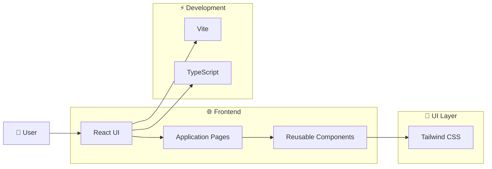
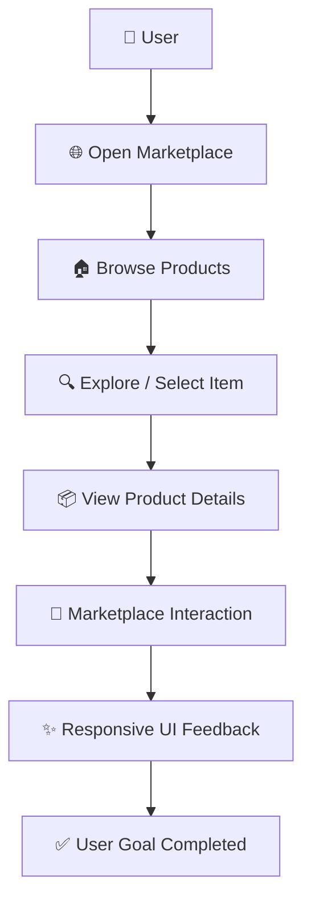

# 🛍️ Market Flex

> **A modern, responsive digital marketplace interface built with React, TypeScript, and Tailwind CSS.**

## ✨ Overview

**Market Flex** is a modern marketplace web application designed to provide a clean, responsive, and engaging shopping experience.

The project focuses on **intuitive UI, reusable components, responsive layouts, and scalable frontend architecture**.

---

## 🚀 Features

* 🛒 Modern marketplace interface
* 📱 Fully responsive design
* 🎨 Clean and reusable UI components
* ⚡ Fast Vite-powered development
* 🧩 Component-based architecture
* 🔎 Product-focused browsing experience
* 💻 Optimized for desktop and mobile

---

## 🏗️ System Architecture

---

## 🔄 Application Flow

---

## 🛠️ Tech Stack

| Technology       | Purpose                     |
| ---------------- | --------------------------- |
| ⚛️ React         | Frontend UI                 |
| 📘 TypeScript    | Type-safe development       |
| 🎨 Tailwind CSS  | Styling & responsive design |
| ⚡ Vite           | Build & development         |
| 🧩 UI Components | Reusable interface elements |
| 🤖 Lovable       | AI-assisted development     |

---

## 💡 Key Highlights

### 🎨 Modern UI

Designed with a clean visual hierarchy and responsive layouts for a smooth user experience.

### 🧩 Reusable Architecture

Built using modular React components to make the application easier to maintain and extend.

### 📱 Responsive Experience

The interface adapts across desktop, tablet, and mobile screen sizes.

### ⚡ Performance-Oriented

Vite provides a fast development environment and optimized production builds.

---

## 🔮 Future Scope

* 🛒 Shopping cart and checkout
* 🔐 User authentication
* 💳 Payment integration
* 📦 Order management
* ❤️ Wishlist functionality
* 🔎 Advanced search and filtering
* 🤖 AI-powered product recommendations
* 📊 Admin analytics dashboard

---

## 👩‍💻 Author

**Prerana D**

Built with ❤️ using **React, TypeScript, Tailwind CSS, and modern web technologies**.

---

⭐ **If you like this project, consider giving it a star!**

